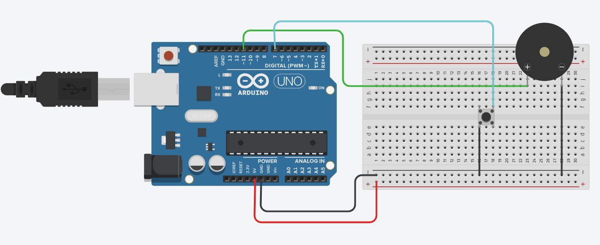

# Happy Birthday Melody

## Project Overview  
This project plays the "Happy Birthday" melody using an Arduino and a piezo buzzer or small speaker. It focuses solely on the audio aspect without any LED lights.

## Components Needed  
- Arduino board (e.g., Arduino Uno)  
- Piezo buzzer or small speaker  
- Breadboard and jumper wires  

## Circuit Diagram  

  

*Note: This circuit only includes the buzzer connected to the Arduino. No LEDs are used.*

## How It Works  
- The Arduino plays the "Happy Birthday" tune by outputting frequencies to the buzzer according to the melody notes and their durations.

## How to Use  
1. Connect the buzzer to the Arduino digital pin (e.g., pin 7) and ground as shown in the circuit diagram.  
2. Upload the provided Arduino code to your board.  
3. Power the Arduino; the buzzer will play the "Happy Birthday" melody.

## Code Explanation  
- The melody notes and durations are stored in arrays.  
- The Arduino loops through the arrays, playing each note for the specified duration using tone functions.

## Troubleshooting  
- If no sound is heard, check buzzer wiring and ensure it is connected to the correct pin.  
- Verify the Arduino is powered and code is properly uploaded.  
- Try using a different buzzer or speaker if needed.

## License  
This project is open-source and free to use for educational purposes.

## Credits

- This project uses or is inspired by the Arduino song melodies from [robsoncouto/arduino-songs](https://github.com/robsoncouto/arduino-songs).  
- Thanks to Robson Couto for maintaining this great collection of Arduino melodies.  
- Additional thanks to the Arduino community for tutorials and support.
