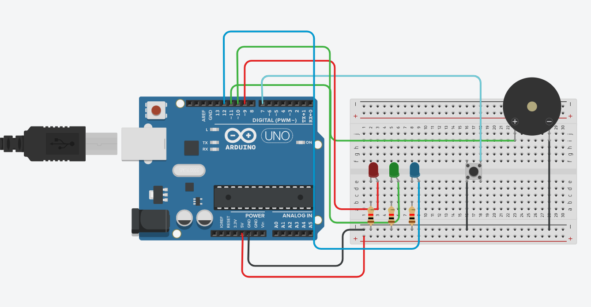

# Flashing Lights with Happy Birthday

## Project Overview  
This project creates a festive light show synchronized with the "Happy Birthday" tune using an Arduino. Three LEDs flash in a rhythmic pattern while the Arduino plays the melody through a piezo buzzer or speaker.

## Components Needed  
- Arduino board (e.g., Arduino Uno)  
- 3 LEDs (different colors recommended)  
- 3 resistors (220Ω recommended)  
- Piezo buzzer or small speaker  
- Breadboard and jumper wires  

## Circuit Diagram  

  

## How It Works  
- The Arduino plays the "Happy Birthday" melody using the buzzer.  
- Simultaneously, the three LEDs flash in a pattern synchronized with the music notes, creating a fun visual effect.

## How to Use  
1. Connect the hardware as per the circuit diagram.  
2. Upload the provided Arduino code to your Arduino board.  
3. Power the Arduino; the LEDs will flash while playing the "Happy Birthday" tune.  

## Code Explanation  
- The melody notes and durations are stored in arrays.  
- A loop goes through each note, playing it on the buzzer and flashing the LEDs accordingly.  
- Timing functions ensure the LEDs flash in rhythm with the music.  

## Credits

- This project uses the Arduino song melodies from [robsoncouto/arduino-songs](https://github.com/robsoncouto/arduino-songs).  
- Thanks to Robson Couto for maintaining this great collection of Arduino melodies.  
- Additional thanks to the Arduino community for tutorials and support.

